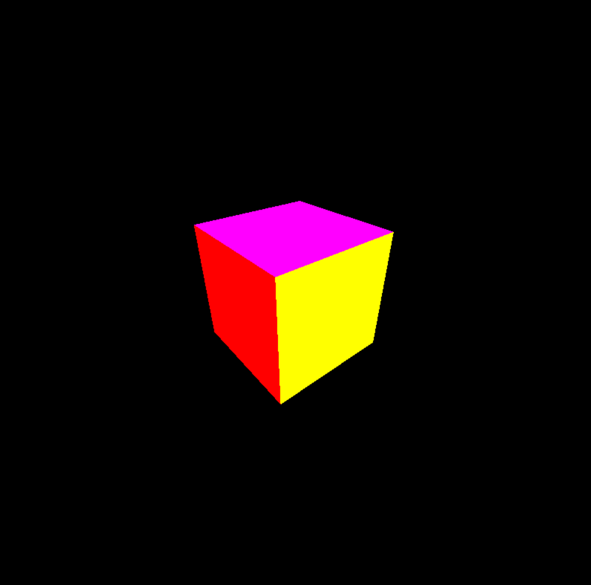

# 3D Engine
3D engine written in Lua and LÖVE capable of rendering 3D cubes. I'll make sure to add more features in the future though.

It is a successor to my previous 3D toy renderer written in C and Raylib, this time with fixed major bugs and more than one model. The biggest change is that the user can move around the world which was not possible in the previous version.